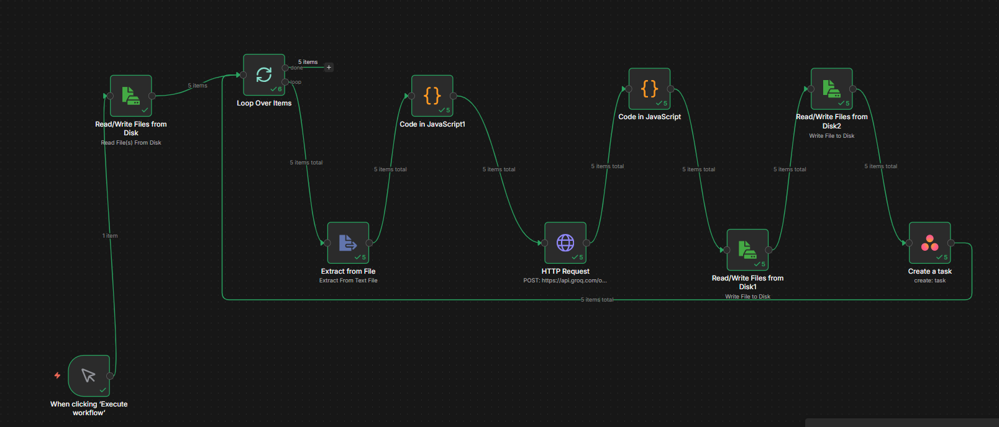
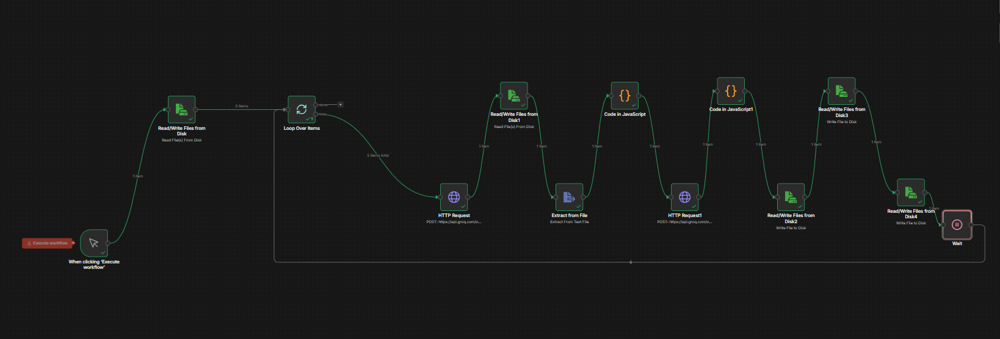

# Clara Answers: Zero-Cost Automation Pipeline



Automates the transformation of messy **sales demo conversations** into
**production-ready AI voice agent configurations** --- using a
completely **zero-cost stack**.

------------------------------------------------------------------------

# 🚀 Project Overview

Clara Answers is an automation pipeline that processes demo calls and
onboarding conversations to automatically generate and update AI voice
agent configurations.

The system converts raw transcripts and audio recordings into structured
JSON configurations ready for deployment.

Two automated pipelines handle the workflow:

Pipeline A → Extracts structured data from demo transcripts.\
Pipeline B → Refines the agent configuration using onboarding audio
recordings.

------------------------------------------------------------------------

# 📸 System Architecture

## Pipeline A --- Demo Call → Agent Spec (v1)


**Purpose** Convert raw demo transcripts into an initial AI agent
configuration.

**Process** 1. Scan transcript dataset 2. Extract structured information
with LLM 3. Generate agent configuration files

**Output**

    outputs/accounts/<account_id>/v1/memo.json
    outputs/accounts/<account_id>/v1/agent_spec.json

------------------------------------------------------------------------

## Pipeline B --- Onboarding → Agent Update (v2)



**Purpose** Update the agent configuration using onboarding calls.

**Process** 1. Transcribe audio using Groq Whisper 2. Compare transcript
with previous configuration 3. Apply structured updates 4. Generate
change logs

**Output**

    outputs/accounts/<account_id>/v2/
    changelog/

------------------------------------------------------------------------

# 🏗 Tech Stack

| Component \| Technology \|

\|----------\|------------\| Workflow Automation \| n8n (Docker Self
Hosted) \| \| LLM Processing \| Groq API (Llama 3 70B) \| \|
Speech‑to‑Text \| Groq Whisper \| \| Storage \| Versioned Local JSON \|
\| Task Automation \| Asana \| \| Containerization \| Docker \|

All services operate within **free tiers**, keeping the system
completely **zero-cost**.

------------------------------------------------------------------------

# 📂 Project Structure

    project-root
    │
    ├── dataset
    │   ├── transcript
    │   └── audio
    │
    ├── outputs
    │   └── accounts
    │
    ├── workflows
    │   ├── pipeline_a.json
    │   └── pipeline_b.json
    │
    ├── changelog
    │
    └── README.md

------------------------------------------------------------------------

# ⚙️ Setup & Run Locally

## 1. Install Prerequisites

Required:

• Docker Desktop\
• Groq API Key\
• Asana Personal Access Token (optional)

Groq Console:

https://console.groq.com

------------------------------------------------------------------------

## 2. Start n8n

Run the following command inside the project directory:

``` bash
docker run -it --rm --name n8n   -p 5678:5678   -v ~/.n8n:/home/node/.n8n   -v "$(pwd)":/home/node/.n8n-files   docker.n8n.io/n8nio/n8n
```

Then open:

    http://localhost:5678

------------------------------------------------------------------------

## 3. Import Workflows

Inside n8n:

Workflows → Import from File

Import:

    workflows/pipeline_a.json
    workflows/pipeline_b.json

Add Groq API key in HTTP nodes:

    Authorization: Bearer YOUR_GROQ_API_KEY

------------------------------------------------------------------------

# 🔁 Pipeline Logic

## Pipeline A --- Extraction

Input

    dataset/transcript/*.txt

Processing

• Loop through transcripts\
• Extract structured business information\
• Prevent hallucination using strict prompts

Output

    memo.json
    agent_spec.json

------------------------------------------------------------------------

## Pipeline B --- Refinement

Input

    dataset/audio/*.m4a

Processing

1.  Transcribe audio
2.  Load previous configuration
3.  Compare transcript with config
4.  Apply structured updates

Output

    updated v2 configuration
    markdown changelog

------------------------------------------------------------------------

# 🧠 Prompt Safety Rules

The AI voice agent must follow strict conversation flows.

## Business Hours Flow

Greeting → Identify request → Collect caller details → Route call →
Fallback → Close

## After Hours Flow

Greeting → Identify request → Check emergency → Collect details →
Transfer → Close

### Forbidden Behavior

The agent must never mention:

• LLM\
• AI model\
• Function calls\
• Internal systems

------------------------------------------------------------------------

# 📊 Reliability Design

### Idempotent Workflows

Repeated runs will safely overwrite outputs without duplicates.

### Retry Protection

All API nodes include retry logic to handle:

• Network failures\
• API timeouts\
• Temporary outages

### Scalable Processing

Loop architecture allows processing unlimited transcripts and audio
files.

------------------------------------------------------------------------

# 💰 Cost Analysis

| Service \| Cost \|

\|-------\|------\| n8n Self Hosted \| Free \| \| Groq LLM \| Free Tier
\| \| Groq Whisper \| Free Tier \| \| Asana \| Free \| \| Local Storage
\| Free \|

Total Cost: **\$0**

------------------------------------------------------------------------

# 🔮 Future Improvements

### Production Database

Replace local JSON with:

Supabase (PostgreSQL)

Benefits:

• relational data\
• analytics\
• easier queries

------------------------------------------------------------------------

### Auto Agent Deployment

Integrate with Retell API

    POST /create-agent

Automatically deploy generated agents.

------------------------------------------------------------------------

### Event Driven Automation

Pipeline B could be triggered automatically via:

• onboarding call completion\
• webhook events\
• CRM updates

------------------------------------------------------------------------

# 👨‍💻 Author

Vivek Shahi

DevOps & Full Stack Developer

Expertise:

Docker • Kubernetes • CI/CD • Cloud Infrastructure • Automation • MERN
Stack

------------------------------------------------------------------------

# ⭐ If you found this project useful

Give it a star on GitHub.
